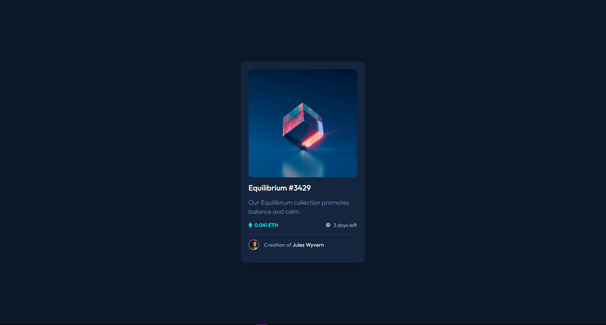

# Frontend Mentor - NFT preview card component Solution

This is a solution to the [Product preview card component challenge on Frontend Mentor](https://www.frontendmentor.io/challenges/nft-preview-card-component-SbdUL_w0U). Frontend Mentor challenges help you improve your coding skills by building realistic projects.

## Table of contents

- [Overview](#overview)
  - [The challenge](#the-challenge)
  - [Screenshot](#screenshot)
  - [Built with](#built-with)
  - [Links](#links)
- [Author](#author)

## Overview

This one was quite a challenge although it is a newbie one. I had a hard time figuring out how to do the active state of the image tint. I realized that overcomplicating will not help, so I started from scratch and figure out other ways. This was a fun challenge and I hope that you learn something from this ^^.

### The challenge

Users should be able to:

- View the optimal layout for the interface depending on their device's screen size
- See hover and focus states for all interactive elements on the page

### Screenshot

### Links

Site Link: https://vercel.com/kohicha/nft-preview-card-component-main-solution

### Built with

- Semantic HTML5 markup
- Grid
- Flexbox
- CSS Grid
- TailwindCSS

# Author

- Frontend Mentor - [@kohicha](https://www.frontendmentor.io/profile/kohicha)
- Twitter - [@eepykohi](https://twitter.com/eepykohi)
